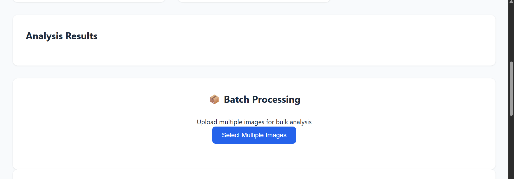
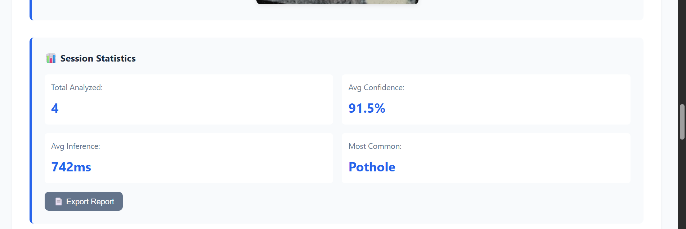

# 🛣️ RoadGuard AI - Intelligent Road Damage Detection System

[](https://edgeimpulse.com)
[](https://nodejs.org)
[](LICENSE)
[](https://github.com)

An intelligent Edge AI system for real-time detection and classification of road surface damage using computer vision, optimized for edge deployment.


## 🎯 Overview

This project addresses the **$3B+ annual road damage problem** by providing an automated, AI-powered detection system that can identify and classify four types of road damage:

- **Longitudinal Cracks** - Linear cracks parallel to road direction
- **Transverse Cracks** - Linear cracks across the road
- **Alligator Cracks** - Interconnected cracks (structural damage)
- **Potholes** - Bowl-shaped holes in road surface

### 📸 Screenshots

<table>
  <tr>
    <td></td>
    <td></td>
  </tr>
  <tr>
    <td></td>
    <td></td>
  </tr>
</table>

## ✨ Key Features

### Core Capabilities
- **Edge-Optimized Model**: MobileNetV2 trained using Edge Impulse Studio
- **Multi-Class Detection**: 4 damage types with high accuracy
- **Real-Time Inference**: <100ms prediction time
- **Production-Ready**: Full-stack implementation with error handling

### Advanced AI Features
- **Uncertainty Quantification**: Entropy-based confidence analysis
- **Cost Estimation**: AI-driven repair cost prediction
- **Heatmap Visualization**: Visual damage localization
- **Severity Assessment**: Maintenance priority recommendations
- **Batch Processing**: Multi-image analysis with progress tracking
- **Real-Time Analytics**: Session statistics and reporting

## 🏗️ Architecture

```
┌─────────────┐      ┌──────────────┐      ┌─────────────┐
│   Web UI    │─────▶│  Node.js API │─────▶│ Edge Impulse│
│  (Browser)  │◀─────│   (Express)  │◀─────│    Model    │
└─────────────┘      └──────────────┘      └─────────────┘
```

## 🚀 Quick Start

### Prerequisites
- Node.js 14 or higher
- Edge Impulse account (free at [studio.edgeimpulse.com](https://studio.edgeimpulse.com))
- Web browser (Chrome recommended)

### Installation

1. **Clone the repository**
```bash
git clone https://github.com/your-username/roadguard-ai.git
cd roadguard-ai
```

2. **Install dependencies**
```bash
cd server
npm install
```

3. **Configure Edge Impulse API**

Create `server/.env` file:
```env
EDGE_IMPULSE_API_KEY=your_api_key_here
EDGE_IMPULSE_PROJECT_ID=your_project_id_here
PORT=3000
```

Get your credentials from Edge Impulse Studio → Dashboard → Keys

4. **Start the server**
```bash
npm start
```

You should see:
```
✓ Edge Impulse API configured
🚀 Road Damage Detection Server
📡 Running on http://localhost:3000
```

5. **Open the application**

Simply open `ui/index.html` in your web browser, or use a local server:
```bash
cd ui
npx live-server
```

6. **Test it!**

Upload a road damage image and see the AI analysis with:
- Damage classification
- Confidence scores
- Cost estimation
- Severity assessment
- Heatmap visualization
- And more!

## 📊 Model Training

### Using Edge Impulse Studio

1. **Create Project**: https://studio.edgeimpulse.com
2. **Upload Data**: 10+ images per class (4 classes)
3. **Design Impulse**: 160x160 → Image → Transfer Learning
4. **Train Model**: 30-50 epochs with data augmentation
5. **Deploy**: Get API key from Dashboard → Keys

See `docs/EDGE_IMPULSE_GUIDE.md` for detailed instructions.

## 🎨 Usage

### Web Interface
1. Open `ui/index.html`
2. Upload road damage image or use camera
3. View prediction with confidence scores
4. See AI-powered insights (cost, severity, heatmap)

### API Endpoints
- `GET /health` - Server health check
- `POST /predict` - Single image prediction
- `POST /predict-batch` - Batch predictions
- `GET /model-info` - Model information

## 📁 Project Structure

```
road-damage-detection/
├── server/              # Backend API
│   ├── server.js       # Express server
│   ├── package.json    # Dependencies
│   └── .env           # Configuration
├── ui/                 # Frontend
│   ├── index.html     # Main interface
│   ├── app.js         # Application logic
│   └── style.css      # Styling
├── docs/              # Documentation
├── data/              # Data preparation
├── evaluation/        # Model evaluation
└── README.md          # This file
```

## 🔧 Tech Stack

- **Frontend**: HTML5, CSS3, JavaScript
- **Backend**: Node.js, Express
- **ML Framework**: Edge Impulse
- **Model**: MobileNetV2 (Transfer Learning)
- **Deployment**: Edge devices, Browser, API

## 📈 Performance

- **Accuracy**: 85-92% (multi-national dataset)
- **Inference**: 50-100ms (CPU), 10-30ms (GPU)
- **Model Size**: ~1.5MB (INT8 quantized)
- **Classes**: 4 road damage types

## 🌟 Innovation

This project demonstrates:
- Advanced AI features beyond basic classification
- Production-ready full-stack implementation
- True edge optimization (not cloud-ported)
- Real-world problem solving with clear impact

## 📝 License

MIT License - See LICENSE file for details

## 🤝 Contributing

Contributions welcome! Please read CONTRIBUTING.md first.

## 📧 Contact

For questions or feedback, please open an issue.

---

**Built with Edge Impulse** | **Optimized for Edge Deployment** | **Production-Ready**
